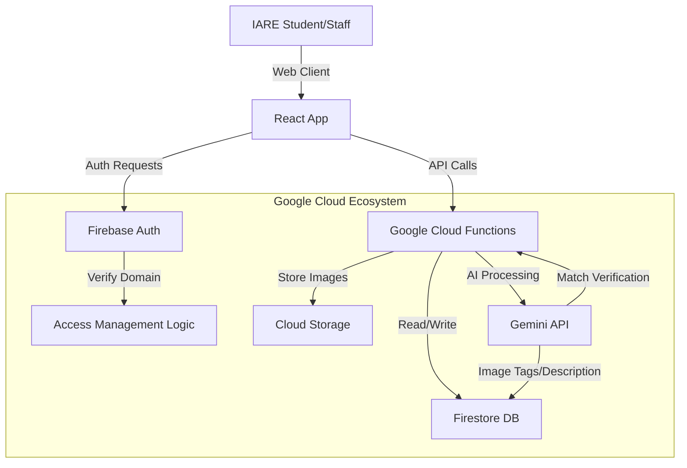

# Secure Lost & Found Portal for IARE College
## Hackathon Architectural Blueprint

### 1. Project Overview & Objective
**Title:** Secure Lost & Found Portal for IARE College
**Core Objective:** To build a verified, secure, and AI-powered platform for IARE students to report and recover lost belongings, leveraging Google's ecosystem for security and automation.
**Target Audience:** IARE Students (Verified via @iare.ac.in), Faculty, and Admin Staff.

---

### 2. System Architecture

#### High-Level Design
The system follows a Serverless Microservices Architecture to ensure scalability and minimize maintenance during the hackathon.

*   **Frontend (Client):** React.js (Vite) + Tailwind CSS (Glassmorphism UI).
*   **Backend (Serverless):** Google Cloud Functions (Node.js) & Firebase Cloud Functions.
*   **Database:** Google Firestore (NoSQL) for real-time updates.
*   **Authentication:** Firebase Authentication (Restricted to `@iare.ac.in`).
*   **Storage:** Firebase Cloud Storage (Images of lost/found items).
*   **AI Engine:** Google Gemini Pro Vision (Image Analysis) & Gemini Pro (Text/Reasoning).

#### Architecture Diagram (Mermaid)


---

### 3. Google Technology Integration (Mandatory)

#### A. Firebase Authentication (Identity & Access)
*   **Why:** We need strict specialized access.
*   **Implementation:** 
    *   Enable **Google Sign-In Provider**.
    *   **Custom Rule:** In the `beforeCreate` auth trigger (GCP Function), we check if `email.endsWith('@iare.ac.in')`. If not, the account creation is blocked immediately.
    *   **Role Management:** Custom Claims in Firebase Auth (`admin: true`) to distinguish between regular Students and Audit/Admin staff.

#### B. Firebase Firestore (Real-time Database)
*   **Why:** Fast, scalable, and syncs data across clients.
*   **Collections:** `users`, `items` (polymorphic for lost/found), `claims`, `notifications`.
*   **Security Rules:** configured so users can only edit their own reports, but Admins can edit all.

#### C. Google Cloud Platform (GCP)
*   **Cloud Functions:** Used for backend logic to keep API keys (Gemini) hidden from the frontend.
*   **Cloud Storage:** Stores verified images of items. Images are processed (compressed/resized) using GCP extensions.

#### D. Google Gemini API (The "Brain")
*   **Use Case 1: Auto-Tagging (Gemini Pro Vision):**
    *   User uploads a photo of a found "Blue Water Bottle".
    *   **Action:** Gemini analyzes the image and extracts tags: `['bottle', 'blue', 'plastic', 'Milton brand']` and generates a description. This standardizes search.
*   **Use Case 2: Smart Matching (Gemini Pro):**
    *   Compare the semantic meaning of a "Lost" report description against "Found" item tags to calculate a `Match Confidence Score`.
*   **Use Case 3: Fraud Detection:**
    *   Gemini compares the "Proof of Ownership" text provided by the claimer against the item's hidden details.

---

### 4. Security Features (Deep Dive)
*   **Domain-Locked Access:** The system strictly rejects any OAuth token that does not belong to the hosted domain `@iare.ac.in`.
*   **AI-Powered Fraud Detection:** 
    *   If a user uploads an image searched from Google (e.g., a stock photo of a watch), visual metadata checks + Gemini "Generic Image Detection" can flag it.
*   **Audit Logs:** Every "Claim" and "Handover" action is logged in an immutable `audit_logs` collection in Firestore for post-event verification.
*   **Data Privacy:** "Found" items do not verify exact location publicly. They only say "Found near Library" to prevent theft. Exact details are released only after claim approval.

---

### 5. Application Workflow

1.  **Login:** User clicks "Sign in with Google". App checks `@iare.ac.in`. Success -> Dashboard.
2.  **Report Found Item:**
    *   User uploads photo.
    *   Gemini analyzes photo -> Pre-fills "Blue Watch, Analog, Leather Strap".
    *   User confirms location (e.g., "Block C Labs").
    *   Item saved to DB.
3.  **Report Lost Item:**
    *   User enters details.
    *   Background Job runs -> Queries DB for matching "Found" items using Vector Search or Tag Matching.
4.  **Match & Claim:**
    *   User sees a potential match. Clicks "That's mine!".
    *   **Challenge:** User must answer a specific question generated by Gemini based on the image (e.g., "What is the text written on the back dial?").
5.  **Verification:**
    *   Admin/Founder reviews the answer.
    *   If approved, a **One-Time Digital Pass (QR)** is generated for pickup.
6.  **Handover:**
    *   Owner shows QR code to Admin/Founder.
    *   Scanned -> Status marks as "Returned".

---

### 6. Database Schema (Firestore)

**Collection: `users`**
```json
{
  "uid": "12345",
  "email": "s.student@iare.ac.in",
  "role": "student", // or "admin"
  "reputationScore": 100
}
```

**Collection: `items`**
```json
{
  "id": "item_001",
  "type": "found", // or "lost"
  "category": "electronics",
  "tags": ["calculator", "casio", "black"],
  "image_url": "gs://...",
  "location": "Library 2nd Floor",
  "founder_uid": "12345",
  "status": "open", // "claimed", "returned"
  "gemini_metadata": {
    "detected_color": "black",
    "detected_brand": "Casio"
  },
  "timestamp": "2023-10-25T10:00:00Z"
}
```

**Collection: `claims`**
```json
{
  "id": "claim_999",
  "item_id": "item_001",
  "claimant_uid": "67890",
  "proof_description": "It has a scratch on the back screen.",
  "status": "pending", // "approved", "rejected"
  "ai_confidence_score": 0.85
}
```

---

### 7. Gemini Prompts & AI Logic

**Prompt 1: Item Analysis (Vision)**
> "Analyze this image of a found item. Return a JSON object with: 1. Integration Title (max 5 words). 2. Detailed Description. 3. List of 5 visual search tags (color, brand, type, condition). 4. A 'generic_image_score' from 0-100 indicating if this looks like a stock photo."

**Prompt 2: Ownership Verification (Reasoning)**
> "I have an item described as 'Black Casio Calculator with a scratch on the cover'. A student is claiming it is theirs. They provided this proof: 'It is a Casio fx-991ES and the battery cover is loose'. Rate the probability (0-100) that this user owns the item based on the unique detail match. Return JSON."

---

### 8. Tech Stack Summary
*   **Frontend:** React (Vite), Tailwind CSS, Framer Motion (Attributes).
*   **State Management:** React Context API / Zustand.
*   **Backend:** Firebase Accounts & Cloud Functions (Node.js).
*   **AI:** Google Gemini 1.5 Flash (fastest for hackathons).
*   **Hosting:** Firebase Hosting.
*   **Maps (Optional):** Google Maps API for picking "Lost Location".

---

### 9. Future Enhancements
*   **Smart Lock Integration:** Found items placed in IoT lockers; QR code opens locker automatically.
*   **Notify All:** Semantic broadcast to all users who "Subscribed" to "Lost Watch" alerts.
